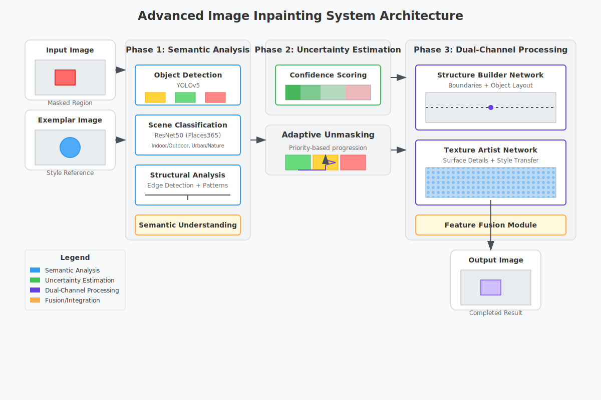

# Intelligent Image Inpainting Research Project

## Introduction: Understanding Image Inpainting

Image inpainting is about intelligently filling missing regions in an image. Traditional approaches often fail because they treat this as a pixel-filling task rather than a scene understanding challenge.

### Why Current Methods Fail
1. **Lack of Scene Understanding**: They generate pixels without understanding what objects should be there
2. **Poor Texture Handling**: They create uniform, unrealistic textures in large missing regions
3. **Structural Inconsistency**: Generated content often doesn't align with existing image structures
4. **Direct Copying Issues**: Reference-based methods often copy pixel-for-pixel, creating obvious artifacts

Our approach addresses these issues by fundamentally rethinking the problem.

## System Architecture



## Phase 1: Theoretical Foundation

### Core Concepts

#### Semantic Understanding
When humans look at a partially occluded object, we can mentally complete it because we understand what that object should look like. Our system needs to develop similar understanding. This involves:
* **Object recognition**: Identifying what's visible in the image
* **Spatial reasoning**: Understanding how objects relate to each other
* **Scene context**: Recognizing the overall environment (indoor/outdoor, etc.)

#### Uncertainty Estimation
Not all parts of a missing region are equally difficult to reconstruct. Some areas have clear contextual clues, while others are ambiguous. By quantifying uncertainty, we can:
* Prioritize easier regions first, building context gradually
* Allocate more computational resources to difficult areas
* Validate our predictions based on confidence levels

#### Dual-Channel Processing
Imagine reconstructing a damaged painting. You would first sketch the basic structure, then add colors and textures. Our dual-channel approach does the same:
* **Channel 1 (Structure)**: Creates the framework of objects and boundaries
* **Channel 2 (Texture)**: Adds realistic surface details and colors

### Mathematical Foundations

#### Vector Spaces and Embeddings
Throughout this project, we represent images as vectors in high-dimensional spaces:
* Images are represented as tensors (3D arrays: height × width × channels)
* Features are extracted as lower-dimensional representations
* Similarity between images can be measured as distance between vectors

#### Convolutions and Feature Extraction
Convolutional Neural Networks (CNNs) are the backbone of our system. Key concepts:
* **Convolution**: Sliding window operation that detects patterns
* **Pooling**: Downsampling that creates translation invariance
* **Feature maps**: Activations that represent detected patterns

#### Attention Mechanisms
Attention allows the model to focus on relevant parts of the input:
* **Self-attention**: Relating different parts of the same input
* **Cross-attention**: Relating parts of different inputs (e.g., exemplar and target)
* **Multi-head attention**: Learning multiple attention patterns simultaneously

## Phase 2: Data Understanding and Preparation

### COCO-Stuff Dataset Deep Dive
The COCO-Stuff 10K dataset is more than just images. It includes:
* **Images**: 10,000 high-quality photographs with diverse content
* **Segmentation Maps**: Pixel-level labels indicating object categories
* **Category Hierarchy**: 183 object categories organized hierarchically

Why this dataset? It provides:
* Diverse scenes (indoor, outdoor, urban, nature)
* Complex object interactions
* High-quality segmentation annotations essential for our approach

### Advanced Mask Generation Techniques

#### Object-Aware Masks
1. **Object Extraction**: Use connected component labeling to extract complete objects
2. **Morphological Operations**:
   * Dilation: Expand object boundaries to ensure complete coverage
   * Erosion: Shrink to remove tiny noise regions
   * Opening/Closing: Combine operations for smooth boundaries
3. **Edge Naturalization**: Add controlled noise to edges using Perlin noise

#### Boundary-Crossing Masks
1. **Boundary Detection**:
   * Compute gradient of segmentation map
   * Identify pixels where neighboring pixels have different labels
   * Create binary boundary map
2. **Mask Placement**:
   * Select random boundary pixel as center
   * Generate shape (circle, rectangle, irregular) centered on this pixel
   * Verify coverage of multiple objects

#### Damage Simulation
1. **Scratch Patterns**:
   * Start from random edge point
   * Simulate path following surface tension dynamics
   * Add width variation for realism
2. **Water Damage**:
   * Use Voronoi tessellation for natural blob shapes
   * Apply gaussian blur for soft edges
   * Simulate gravity effects on drip patterns

## Phase 3: Network Architecture Deep Dive

### Object Detection Module (YOLOv5)
Why YOLOv5?
* Real-time performance (>100 FPS on GPU)
* High accuracy for common object categories
* Easy to adapt for COCO classes

Implementation Details:
1. **Input Preprocessing**:
   * Resize to 640×640 (maintains aspect ratio with padding)
   * Normalize using ImageNet statistics
2. **Backbone Architecture**:
   * CSPDarknet53 with cross-stage partial connections
   * 5 resolution scales for multi-scale detection
   * Spatial pyramid pooling for scale invariance

### Scene Classification Module
Architectural Modifications:
1. **Global Context Pooling**:
   * Replace final average pooling with spatial pyramid pooling
   * Concatenate features from multiple scales (1×1, 2×2, 4×4)
   * Creates richer scene representation
2. **Scene Category Reduction**:
   * Group 365 Places classes into 50 meta-categories
   * Use hierarchical softmax for efficiency

### Structural Analysis Module
Component 1: **Edge Detection Pipeline**
1. Multi-scale Canny:
   * Apply Canny at 3 scales (σ = 0.5, 1.0, 2.0)
   * Combine results using logical OR
   * Thin edges using morphological skeletonization

Component 2: **Line and Pattern Detection**
1. Probabilistic Hough Transform:
   * Parameters: θ resolution=1°, ρ resolution=1px
   * Minimum line length=30 pixels
   * Maximum line gap=10 pixels

### Uncertainty Estimation Network
Architecture Breakdown:
1. **Input Processing**:
   * Concatenate: RGB image, mask, edge map, semantic features
   * Apply channel-wise attention to weight different inputs
   * Use learnable positional encoding for spatial awareness
2. **Feature Extraction**:
   * 6 convolutional blocks with residual connections
   * Progressive downsampling (stride=2 every 2 blocks)
   * ELU activation for better gradient flow

### Structure Builder Network
Key Innovations:
1. **Attention-Augmented Convolutions**:
   * Replace standard convolutions with attention-augmented versions
   * Allow dynamic kernel shapes based on content
   * Maintain computational efficiency
2. **Boundary-Aware Processing**:
   * Explicit edge loss during training
   * Gated convolutions for masked regions
   * Differentiable edge detector in forward pass

### Texture Artist Network
Cross-Attention Mechanism:
1. **Feature Alignment**:
   * Extract deep features from exemplar and target
   * Use deformable attention for flexible matching
   * Apply multi-head attention for diverse patterns
2. **Style Modulation**:
   * Compute style statistics (mean, variance) per feature channel
   * Use AdaIN for basic style transfer
   * Add spatial modulation for local variations

## Phase 4: Training Implementation Details

### Loss Function Mathematics
**Reconstruction Loss**:
```
L_recon = λ₁·L1(output, target) + λ₂·L2(output, target)
where λ₁=1.0, λ₂=0.5
```

**Perceptual Loss**:
```
L_perceptual = Σᵢ λᵢ·||φᵢ(output) - φᵢ(target)||₂²
where φᵢ are VGG features at layer i
λᵢ = [0.125, 0.25, 0.5, 1.0] for layers 1-4
```

**Style Loss**:
```
L_style = Σᵢ ||G(φᵢ(output)) - G(φᵢ(exemplar))||₂²
where G is Gram matrix operation
```

**Adversarial Loss**:
```
L_adv = max(0, 1 - D(output)) + max(0, 1 + D(target))
(Hinge loss formulation for stability)
```

### Training Stabilization Techniques
1. **Gradient Strategies**:
   * Gradient clipping by norm (threshold=1.0)
   * Gradient penalty for discriminator
   * Gradient accumulation for large effective batch size
2. **Learning Rate Scheduling**:
   * Linear warmup for first 5000 iterations
   * Cosine annealing with warm restarts
   * Different LR for generator and discriminator

## Phase 5: Evaluation Framework

### Metric Implementation
**PSNR Calculation**:
```
PSNR = 20·log₁₀(MAX_I) - 10·log₁₀(MSE)
where MAX_I is maximum pixel value (255 for 8-bit)
MSE is mean squared error
```

**SSIM Computation**:
1. Compare luminance, contrast, and structure
2. Apply gaussian weighting
3. Combine with exponential weights

**LPIPS Details**:
1. Extract features using pre-trained AlexNet
2. Compute normalized distances in feature space
3. Apply learned weights for perceptual relevance

## Phase 6: Advanced Optimization Techniques

### Memory Efficiency
1. **Gradient Checkpointing**:
   * Save activations only at block boundaries
   * Recompute intermediate values during backward pass
   * Trade computation for memory
2. **Mixed Precision Training**:
   * Use FP16 for forward/backward passes
   * Maintain FP32 master weights
   * Apply loss scaling to prevent underflow

### Speed Optimization
1. **Kernel Fusion**:
   * Combine multiple operations into single kernel
   * Reduce memory transfers
   * Optimize for specific GPU architecture
2. **Model Quantization**:
   * Post-training quantization to INT8
   * Layer-wise quantization calibration
   * Quantization-aware training for critical layers

## Phase 7: Research Methodology

### Experiment Design
1. **Control Variables**:
   * Random seeds for reproducibility
   * Fixed train/val/test splits
   * Standardized evaluation protocol
2. **Ablation Studies**:
   * Remove each component systematically
   * Measure impact on performance
   * Analyze failure modes

### Result Analysis
1. **Statistical Significance**:
   * Run experiments with multiple seeds
   * Report mean and standard deviation
   * Use statistical tests for comparison
2. **Error Analysis**:
   * Categorize failure cases
   * Identify common patterns
   * Propose targeted improvements

## Project Structure

```
├── config/                 # Configuration files
├── data/                   # Data processing and loading modules
│   ├── dataset.py          # Dataset implementations
│   ├── mask_generator.py   # Advanced mask generation techniques
│   └── preprocessing.py    # Image preprocessing utilities
├── models/                 # Neural network models
│   ├── detection.py        # Object detection module (YOLOv5)
│   ├── scene.py            # Scene classification module
│   ├── structure.py        # Structural analysis module
│   ├── uncertainty.py      # Uncertainty estimation network
│   ├── builder.py          # Structure builder network
│   ├── texture.py          # Texture artist network
│   └── discriminator.py    # Adversarial discriminator
├── utils/                  # Utility functions
│   ├── losses.py           # Loss function implementations
│   ├── metrics.py          # Evaluation metrics
│   └── visualization.py    # Visualization tools
├── train.py                # Training script
├── eval.py                 # Evaluation script
├── inpaint.py              # Inference script for inpainting
└── requirements.txt        # Dependencies
```

## Setup

### Prerequisites
- Python 3.8+
- PyTorch 2.0+
- CUDA (optional, for GPU acceleration)

### Installation

1. Clone the repository:
```bash
git clone https://github.com/username/image-inpainting-research.git
cd image-inpainting-research
```

2. Create a virtual environment:
```bash
python -m venv venv
source venv/bin/activate  # On Windows: venv\Scripts\activate
```

3. Install dependencies:
```bash
pip install -r requirements.txt
```

### Data Preparation

1. Download the COCO-Stuff 10K dataset:
```bash
python data/download_coco.py
```

2. Process the dataset for training:
```bash
python data/prepare_dataset.py
```

## Usage

### Training

```bash
python train.py --config config/default.yaml
```

### Evaluation

```bash
python eval.py --model_path checkpoints/best_model.pth --data_path data/test
```

### Inpainting

```bash
python inpaint.py --image path/to/image.jpg --mask path/to/mask.png --output result.png
```

## Acknowledgements

- COCO-Stuff 10K dataset
- YOLOv5 for object detection
- PyTorch community

## License

MIT 